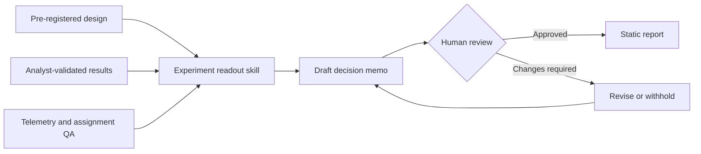

# A/B Testing Conversion Funnel

An end-to-end conversion-funnel experiment in an insurance journey. This portfolio project demonstrates behavioural diagnosis, prioritised hypotheses, a controlled A/B test implementation, statistically literate evaluation, and practical QA.

## Report preview

### 1. Overview

<p align="center"><a href="assets/screenshots/01-overview.png"></a></p>

### 2. Funnel analysis

<p align="center"><a href="assets/screenshots/02-funnel-analysis.png"></a></p>

### 3. Experiment results

<p align="center"><a href="assets/screenshots/03-experiment-results.png"></a></p>

### 4. Quote prototype · Control/Treatment

<p align="center"><a href="assets/screenshots/04-quote-prototype.gif"></a></p>

### 5. Methodology

<p align="center"><a href="assets/screenshots/05-methodology.png"></a></p>

## Run it

Open `index.html` in a browser. No build step is required. The dashboard uses the Highcharts CDN for its interactive charts.

## What to explore

- **Experiment dashboard** — a stakeholder-ready decision view with guardrails, confidence intervals, and device-level results.
- **Quote-flow prototype** — switch between control and treatment to inspect the live A/B test experience.
- **Experiment plan** — method, sample-size rationale, tracking plan, and decision rules.
- **Production implementation** — LaunchDarkly assignment, Amplitude instrumentation, consent handling, rollout, and rollback.
- **AI-assisted readout** — a governed, tool-agnostic agent skill drafts decision memos from analyst-validated evidence.
- **Roadmap** — a transparent prioritisation model across a realistic insurance journey.

## AI-assisted readout workflow

The [`experiment-readout`](.agents/skills/experiment-readout/SKILL.md) skill turns a pre-registered design, validated result summary, and QA evidence into a draft decision memo. It does not calculate the primary statistics, change experiment configuration, or approve a launch. Every output remains marked as an AI-assisted draft until a human analyst and decision owner approve it.

No vendor API or SDK is required. Tools that support agent skills can load `SKILL.md` directly; with any other file-aware AI assistant, use this portable prompt:

```text
Follow the instructions in .agents/skills/experiment-readout/SKILL.md to draft a decision memo from docs/experiment-design.md, data/validated-experiment-result.json, and docs/qa-and-tracking-plan.md.
```



## Case summary

**Problem:** mobile visitors who reach coverage selection abandon at a materially higher rate than desktop visitors. Session replay and form analytics indicate decision overload: three packages, optional add-ons, and price information compete for attention on a small screen.

**Hypothesis:** presenting one recommended cover with a concise comparison and reassurance copy will increase mobile quote completion without increasing pricing confusion or support-contact intent.

**Result:** the treatment increased mobile quote completion by **2.6 percentage points** (95% CI: 0.7–4.5pp), with no adverse guardrail signal. The simulated recommendation is to roll out progressively and monitor customer outcome metrics.

All customer data in this repository is synthetic.

## Repository map

```text
index.html               Interactive portfolio dashboard and quote prototype
.agents/skills/          Governed AI-assisted experiment readout workflow
assets/                  Styles and dashboard behaviour
data/                    Synthetic event snapshot and validated result input
sql/                     Reproducible funnel and SRM queries
docs/                    Design, production implementation, roadmap, QA, and readout documents
```

## Principles demonstrated

- Primary metric, guardrails, decision rules, and sample size specified before analysis.
- Intention-to-treat analysis with one visitor-level assignment per experiment.
- Segment results used to explain outcomes, not to hunt for significance.
- Customer comprehension and error rate protected alongside conversion.
- A test is not a launch until instrumentation, browser/device QA, and rollback are verified.
