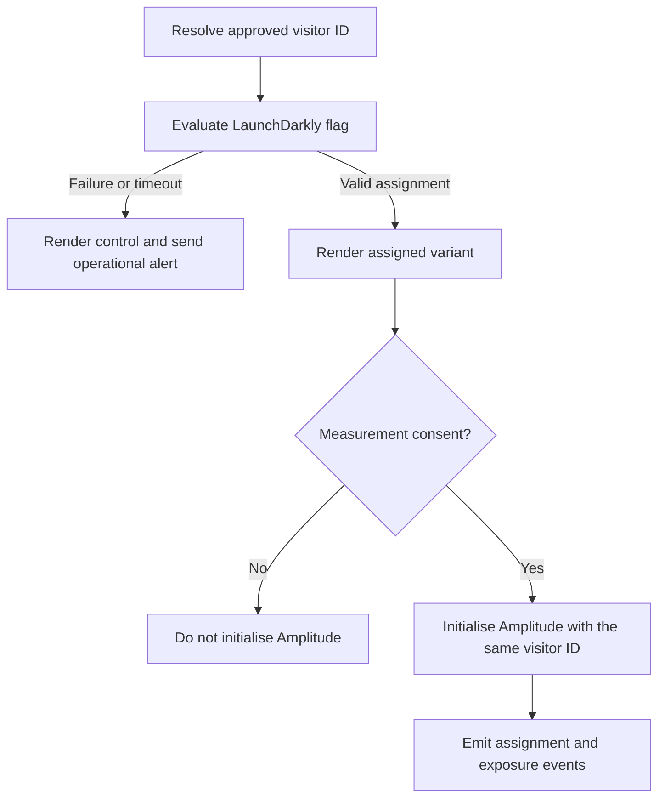

# Production implementation: LaunchDarkly and Amplitude

This runbook translates the experiment design into a production web implementation. It assumes LaunchDarkly JavaScript SDK v4 (`@launchdarkly/js-client-sdk`) for assignment and Amplitude Browser SDK 2 (`@amplitude/analytics-browser`) for behavioural measurement. Pin exact versions in the consuming application and re-check the linked vendor documentation before upgrading.

The repository itself is a dependency-free prototype, so the code below is an integration reference rather than code executed by `index.html`.

## System boundary

| Responsibility | System of record | Production rule |
| --- | --- | --- |
| Eligibility and variant assignment | LaunchDarkly | Evaluate once against a stable, non-PII visitor key |
| UI exposure | Web application | Record exposure only after the assigned UI renders |
| Behavioural events | Amplitude | Send only approved events and properties after measurement consent |
| Experiment result | Warehouse query | Join on visitor ID, deduplicate assignment, and analyse intention-to-treat |
| Release and rollback | LaunchDarkly | Targeting off serves control; the application also defaults to control |

LaunchDarkly and Amplitude must receive the same pseudonymous `visitor_id`. Do not send a quote number, policy number, CPR number, email address, name, full address, free text, or unbanded quote price to either client-side SDK.

## Environment configuration

Use separate LaunchDarkly environments and Amplitude projects for development, staging, and production. Inject these public browser credentials at deploy time; never choose the environment from a URL parameter or other visitor-controlled input.

```text
PUBLIC_LD_CLIENT_SIDE_ID=<environment-specific client-side ID>
PUBLIC_AMPLITUDE_API_KEY=<environment-specific browser API key>
APP_ENV=production
```

A LaunchDarkly client-side ID is intended to be present in browser code, but a server-side SDK key is secret and must never be bundled. Restrict production configuration changes with least-privilege roles, approvals, and an audit trail.

## Identifier lifecycle

1. Read the first-party `visitor_id`, or create a random opaque ID if the applicable consent/legal-basis policy permits it.
2. Keep the ID stable across refreshes and return visits so LaunchDarkly gives one visitor a consistent assignment.
3. Use the identical value as the LaunchDarkly context key and Amplitude device ID. Do not let each SDK independently create the experiment identity.
4. On authentication, retain the device context for this experiment. If the application changes the LaunchDarkly context, await `identify()` before evaluating again; otherwise the SDK can temporarily return values from the previous context.
5. On consent withdrawal or an approved deletion request, stop analytics collection and invoke the organisation's deletion workflow. Clearing a browser identifier alone does not delete previously ingested data.

The experiment population is anonymous visitors, so a minimal LaunchDarkly context is sufficient:

```ts
const context = {
  kind: "device",
  key: visitorId,
  anonymous: true,
};
```

Only add targeting attributes that have a documented use. Mark sensitive attributes private or omit them entirely; omission is preferred when the attribute is unnecessary.

## LaunchDarkly flag

Create a string flag with these settings:

| Setting | Value |
| --- | --- |
| Flag key | `quote-cover-recommendation-v1` |
| Variations | `control`, `treatment` |
| Targeting-off variation | `control` |
| Client-side availability | SDKs using client-side ID |
| Eligibility | production, Danish home-insurance quote, mobile web |
| Allocation | 50% control / 50% treatment by device context key |
| Exclusions | employees, bots, unsupported journeys, measurement-consent exclusions where required |

Put narrow exclusions and QA targets above the percentage rollout because LaunchDarkly evaluates rules in order. Have a second person review the production diff before saving. Do not edit allocation or targeting during the analysis window unless responding to a pre-defined stop condition; any emergency change must be timestamped in the experiment log.

### Browser integration

The application must have one LaunchDarkly client per project. It renders control on timeout, invalid values, or evaluation failure and must never block the quote journey on an SDK response.

```ts
import { createClient } from "@launchdarkly/js-client-sdk";

const FLAG_KEY = "quote-cover-recommendation-v1";
const ALLOWED_VARIANTS = new Set(["control", "treatment"]);

export async function assignCoverExperiment(visitorId: string) {
  const context = { kind: "device", key: visitorId, anonymous: true };
  const client = createClient(PUBLIC_LD_CLIENT_SIDE_ID, context, {
    // Set to false when flag delivery is allowed but analytics events are not.
    sendEvents: hasMeasurementConsent(),
  });

  client.start();
  const status = await client.waitForInitialization({ timeout: 3 });

  if (status.status !== "complete") {
    reportOperationalMetric("ld_initialization_fallback", status.status);
    return { variant: "control" as const, client };
  }

  const evaluated = client.variation(FLAG_KEY, "control");
  const variant = ALLOWED_VARIANTS.has(evaluated) ? evaluated : "control";

  return { variant: variant as "control" | "treatment", client };
}
```

Keep the loading state visually neutral until assignment resolves, or bootstrap an approved initial flag value, to prevent control content flashing before treatment. A three-second timeout is intentionally within LaunchDarkly's documented maximum recommendation of five seconds. Record the fallback in operational monitoring, not as a customer analytics event when consent is absent.

If secure mode is required by the threat model, generate the context hash on the server with the environment SDK key and supply it to the browser SDK. Never calculate that HMAC in browser code or expose the SDK key.

## Amplitude instrumentation

Initialise Amplitude only after measurement consent. For this experiment, explicit events are safer than broad autocapture: insurance pages may contain sensitive field labels, values, URLs, or validation text. The EU server zone is appropriate only when the organisation's Amplitude project was provisioned in the EU data region.

```ts
import * as amplitude from "@amplitude/analytics-browser";

let analyticsVisitorId: string | undefined;

export async function startAnalytics(visitorId: string) {
  if (!hasMeasurementConsent()) return false;

  const result = await amplitude.init(PUBLIC_AMPLITUDE_API_KEY, undefined, {
    deviceId: visitorId,
    serverZone: "EU",
    autocapture: false,
    logLevel: amplitude.Types.LogLevel.Warn,
  }).promise;

  if (result.code === 200) analyticsVisitorId = visitorId;
  return Boolean(analyticsVisitorId);
}

export function trackExperimentEvent(
  eventType: string,
  variant: "control" | "treatment",
  properties: Record<string, string | number | boolean> = {},
) {
  if (!hasMeasurementConsent() || !analyticsVisitorId) return;

  amplitude.track(eventType, {
    experiment_id: "quote-cover-recommendation-v1",
    variant,
    visitor_id: analyticsVisitorId,
    ...properties,
  });
}

export function withdrawAnalyticsConsent() {
  amplitude.setOptOut(true);
  analyticsVisitorId = undefined;
}
```

Do not infer successful delivery from calling `track()`. In staging, await selected calls' `.promise` result and inspect the ingested event in Amplitude User Lookup. In production, monitor accepted-event volume and warehouse reconciliation without delaying customer interactions. Use `flush()` only at an intentional lifecycle boundary; the SDK already flushes periodically.

### Event contract

Events use snake case to match the experiment design. The wrapper adds the common `experiment_id`, `variant`, and `visitor_id` properties. Reject unknown properties rather than forwarding arbitrary component state.

| Event | Fire when | Required properties beyond the common fields | Cardinality and QA rule |
| --- | --- | --- | --- |
| `experiment_assigned` | A valid assignment is available, before interaction | `assignment_source` | At most once per page lifecycle; warehouse retains the visitor's first valid assignment |
| `cover_recommendation_viewed` | Treatment recommendation is actually visible | `cover_id`, `reason_version` | Treatment only; never fire from flag evaluation alone |
| `cover_option_selected` | A visitor selects a cover | `cover_id` | One per committed selection; document whether reselection creates another event |
| `quote_completed` | Backend confirms quote completion | `quote_value_band` | Prefer a server event with a stable event ID for deduplication |
| `support_opened` | Support entry point opens | `topic` | `topic` must come from an allowlist, never from entered text |

`visitor_id` is the analysis join key but should be applied centrally by the wrapper, not copied manually at each call site. The backend should authoritatively emit `quote_completed`; if both browser and server events exist during migration, share a deterministic `event_id` and deduplicate them.

## Render and exposure sequence



The warehouse denominator is the first valid `experiment_assigned` event for each eligible visitor. A visitor remains in that assigned variant for intention-to-treat analysis even if the recommendation is not seen or the flag later falls back. `cover_recommendation_viewed` is a mechanism diagnostic, not the primary-metric denominator.

## Failure behaviour and observability

| Failure | Customer behaviour | Data behaviour | Alert |
| --- | --- | --- | --- |
| LaunchDarkly timeout/unavailable | Render control and keep journey usable | Do not fabricate treatment assignment | Fallback rate above 1% for 15 minutes |
| Unknown flag value | Render control | Log schema error; exclude malformed assignment | Any production occurrence |
| Amplitude unavailable | Keep journey usable | Buffer per SDK defaults; no local business retry loop | Accepted events fall below expected range |
| Consent absent/withdrawn | Keep assigned experience if legally permitted | Do not initialise, or opt out immediately | Any post-withdrawal event in consent QA |
| Variant changes mid-journey | Keep the journey's initial in-memory variant | Record mismatch for investigation | Any confirmed reassignment |
| Primary UI error | Render the existing control component | Preserve error telemetry without form contents | Error-rate guardrail threshold |

Operational logs may include experiment ID, environment, SDK status, and a one-way-correlated request ID. They must not include SDK keys, full contexts, event payloads, quote answers, or personal data.

## Production release checklist

- [ ] Exact SDK versions are pinned and their browser support matches the application support matrix.
- [ ] Development, staging, and production use distinct LaunchDarkly environments and Amplitude projects.
- [ ] Production uses the LaunchDarkly client-side ID; no server-side SDK key appears in the JavaScript bundle or source maps.
- [ ] Flag variations, off value, rule order, allocation, and client-side availability received two-person review.
- [ ] The same approved `visitor_id` reaches both SDKs and remains stable through refresh, return visit, and authentication.
- [ ] No PII, full URL query string, free text, exact price, form value, or policy identifier appears in vendor payloads.
- [ ] Amplitude autocapture is disabled and the event/property allowlist is enforced.
- [ ] No Amplitude request occurs before consent; withdrawal is tested with `setOptOut(true)`.
- [ ] Assignment, actual exposure, selection, completion, support, and error paths are validated in staging and production debug traffic.
- [ ] Event counts reconcile from browser/network inspection to Amplitude User Lookup and the warehouse.
- [ ] Refresh, back navigation, multiple tabs, repeat visits, slow network, blocked vendor domains, and SDK timeout all preserve a stable experience.
- [ ] Control is verified as the LaunchDarkly off variation and code fallback; the rollback owner has tested the kill switch.
- [ ] Dashboards alert on assignment loss, sample-ratio mismatch, fallback rate, unknown variants, and guardrail thresholds.

## Rollout and rollback

1. Target employees and synthetic test identities in production; filter them from analysis.
2. Release to 1% of eligible traffic and verify payload privacy, assignment stability, and accepted event volume.
3. Increase to 10%, then 50/50 only after the named engineering, analytics, privacy, and product owners sign the gate.
4. Freeze targeting for the pre-specified analysis window.
5. For a severe defect or customer-harm signal, turn targeting off. Because both the off variation and code fallback are control, rollback does not require a deploy.
6. Record the exact rollback time, reason, affected traffic, and data-quality impact before interpreting results.

After the experiment, retain the flag during the progressive rollout and holdout period. When the decision is final, remove the treatment branch and instrumentation in a normal release, confirm control-equivalent behaviour, then archive the flag. A permanent flag is operational debt.

## Official references

- [LaunchDarkly JavaScript SDK reference](https://launchdarkly.com/docs/sdk/client-side/javascript) — v4 package, singleton lifecycle, client-side IDs, initialization timeout, fallbacks, and client-side flag availability.
- [LaunchDarkly contexts](https://launchdarkly.com/docs/home/flags/contexts) and [identifying contexts](https://launchdarkly.com/docs/sdk/features/identify) — stable evaluation context and context-change behaviour.
- [LaunchDarkly secure mode](https://launchdarkly.com/docs/sdk/features/secure-mode) — server-generated context signing for browser evaluation.
- [LaunchDarkly targeting rules](https://launchdarkly.com/docs/home/flags/manage-rules) — evaluation order and fallback behaviour.
- [Amplitude Browser SDK 2](https://amplitude.com/docs/sdks/analytics/browser/browser-sdk-2) — initialization, EU server zone, explicit tracking, autocapture controls, opt-out, and flushing.
- [Amplitude user and event properties](https://www.amplitude.com/docs/data/user-properties-and-events) — choosing persistent user properties versus event-scoped properties.
- [Amplitude privacy and consent implementation](https://amplitude.com/docs/data/privacy-and-consent-implementation) — consent-state validation and ingestion checks with User Lookup.
